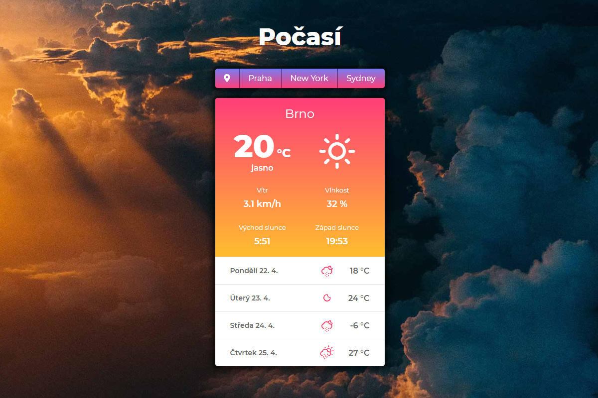

# Úkol 7 - Počasí

Vytvoř aplikaci, která bude ukazovat aktuální počasí ve vybraném místě a předpověď na další 4 dny.

Tento úkol je povinný, ale má spoustu volitelných částí pro ty, kteří základy v pohodě ovládají a chybí jim v kurzu nějaká výzva. Nelekej se dlouhého zadání - popisuji ti podrobně krok za krokem, co máš dělat, a část tvoří právě ty volitelné úkoly pro šprtky.

**Obsah:**
- [Co budeš potřebovat](#Co-budeš-potřebovat)
- [Povinná část úkolu](#Povinná-část-úkolu)
- [Bonusové úkoly](#Bonusové-úkoly)
- [Instalace startovního balíčku pro úkol](#Instalace-startovního-balíčku-pro-úkol)





## Co budeš potřebovat

Tento úkol používá API serveru [OpenWeatherMap](https://openweathermap.org). Pro používání API se musíš zaregistrovat a získat svůj osobní **API klíč**, který je potřeba přikládat jakou autentifikaci ke každému dotazu do API.

Registraci a klíč už bys měla mít z dřívějška, když jsme s počasím pracovali v předchozích lekcích.

Verze API, která je zdarma, má **limit 60 dotazů za minutu**, takže při zkoušení dej pozor, abys třeba neobnovovala stránku nebo příliš často. Pokud máš ve VS Code zapnuté automatické ukládání, tak si ho raději vypni (ale nezapomeň potom ukládat!).


## Povinná část úkolu

Opravud povinné jsou první dva body v seznamu. Třetí je zahrnut v povinné části a chtěl bys, abys ho opravdu zkusila, ale prominu ti, pokud na to nebudeš mít čas. Ale zkus to prosím.

První bod bys měla zvládnout v pohodě, druhý bude možná trochu těžší. **Ptej se na cokoliv** - na Facebooku nebo na lekcích, případně na konzultačních hodinách. Odpovím na jakýkoliv dotaz. Úkol není test, zda už všechno umíš, ale naopak způsob, jak se všechno naučit a zkusit si to. Takže ještě jednou, prosím, **ptej se**.

Celou aplikaci můžeš napsat jako prasátko přímo do souboru *index.js*, ale zkus raději vymyslet, tak funkcionalitu oddělit do samostatného modulu (nebo více), kde vytvoříš třídu nazvanou třeba Weather, kterou pak do hlavního skriptu naimportuješ a budeš ji tam používat.

Nevíš-li jak, smířím se s tím, že to napíšeš alespoň nějak. Ale lepší bude, když se zeptáš a vymyslíme to nějak spolu, jak to udělat s těmi moduly.

Takže úkoly:

### **1. Zjisti aktuální počasí vy vybraném městě**

Vyber si nějaké město (např. Brno) a polož dotaz do API na adresu:

`https://api.openweathermap.org/data/2.5/weather?q=Brno,cz`

Nezapomeň, že do adresy musíš přidat i svůj API klíč do parametru *appid* a pokud chceš data ve stupních celsia a v čestině, musíš přidat parametry i pro to. Parametry se oddělují znakem `&`. Na po5ad9 parametrů nezáleží.

Celá adresa pro ujistění aktuálního počasí v daném městě pak může vypadat například takto (kde *XXXXX* nahradíš svým skutečným API klíčem):

`https://api.openweathermap.org/data/2.5/weather?q=Brno,cz&units=metric&lang=cz&appid=XXXXX`

Podrobnosti o případných dalších parametrech a o tom, jaká data API vrací zpátky si můžeš zjistit v [dokumentaci pro API aktuálního počasí](https://openweathermap.org/current).

Z dat, která ti API vrátí budeš potřebovat následující údaje:
- název místa: `name`
- aktuální teplotu: `main.temp`
- slovní popis počasí (např. polojasno): `weather[0].description`
- ID počasí: `weather[0].id`
- ikonu počasí: `weather[0].icon`
- vlhkost vzduchu: `main.humidity`
- rychlost větru: `wind.speed`
- čas východu slunce: `sys.sunrise`
- čas západu slunce: `sys.sunrise`


### **2. Zobraz data na stránce**

V HTML a CSS je připravená šablona celé aplikace. Data získaná z API stačí vzít a doplnit je do vybraných prvků na stránce.

Prvky na stránce mají vždy přidělené id: `mesto`, `teplota`, `popis`, `ikona`, `vitr`, `vlhkost`, `vychod`, `zapad`. Až na výjimky stačí měnit jejich textový obsah, takže u jednotlivých elementů používej vlastnost `textContent`.

Ale... (snad sis nemyslela, že to bude jen tak :))

- Aktuální teplota je někdy desetinné číslo, což se nám nelíbí. Zaokrouhli na celé číslo pomocí `Math.round()` - [dokumentace](https://developer.mozilla.org/en-US/docs/Web/JavaScript/Reference/Global_Objects/Math/round).
- Rychlost větru bývá někdy uvedena na více desetinných míst, my chceme zobrazovat pouze jedno desetinné místo. Použij třeba metodu `toFixed()` - [dokumentace](https://developer.mozilla.org/en-US/docs/Web/JavaScript/Reference/Global_Objects/Number/toFixed).
- Čas východu a západu slunce přišla z API ve formátu, kterému se říká **UNIX timestamp**. Když se podíváš do dat, uvidíš, že východ slunce je tam uveden třeba jako číslo *1555818654*. UNIX timestamp udává čas jako počet vteřin, který uběhl od 1.1.1970 00:00:00. Asi chápeš, že tohle uživateli opravdu zobrazovat nechceme :) JavaScript má vestavěný datový typ datum/čas a ty můžeš použít následující princip pro převod čísla z API na javascriptové datum (dokumentace pro [Date](https://developer.mozilla.org/en-US/docs/Web/JavaScript/Reference/Global_Objects/Date), [getHours](https://developer.mozilla.org/en-US/docs/Web/JavaScript/Reference/Global_Objects/Date/getHours), [getMinutes](https://developer.mozilla.org/en-US/docs/Web/JavaScript/Reference/Global_Objects/Date/getMinutes)):
```javascript
// převede UNIX timestamp na javascriptový objekt datum/čas
let datum = new Date(hotnotaUnixTimestamp * 1000);

// z tohoto objektu pak můžeme získat hodiny, minuty (a další) pomocí vestavěných metod
let hodiny = datum.getHours();
let minuty = datum.getMinutes();
```

- Největší oříšek je asi ikona počasí. V datech z API je název obrázku ikony (např. `01d`), který pak můžeš do stránky nalinkovat přímo z OpenWeatherMap z adresy `http://openweathermap.org/img/w/10d.png`. Podrobnosti o ikonách najdeš v [dokumentaci API](https://openweathermap.org/weather-conditions).

Teoreticky tedy stačí dovnitř prvku v HTML, který má `id="ikona"`, vložit obrázek s příslušnou adresou. Toto je ta výjimka, kde musíš použít `innerHTML`, protože budeš do prvku vkládat HTML obsah (značku obrázku).

Pokud to uděláš takhle, nebudu se zlobit. Já mám s ikonami z OpenWeatherMap jediný problém - jsou hrozně hnusné a do designu mé aplikace se vůbec nehodí :)

Připojil jsem proto do startovního balíčku i speciální font a CSS styl, s jejichž pomocí jdou vkládat krásné ikony počasí. Problém je, že je potřeba převést kód ikony a stavu počasí získaný z OpenWeatherMap na jiný kód, který vykreslí příslušnou ikonu z připojeného fontu.

Abys toto nemusela dělat, máš ve startovním balíčku i hotovou funkci v samostatném modulu, která to udělá za tebe. Do funkce je potřeba předat dva parametry: id počasí a kód ikony. Abys mohla funkci použít, musíš do souboru, kde ji voláš, naimportovat daný modul. Třeba  takhle:

```javascript
// naimportuj modul s funkcí pro konverzi starých ikon na nové
import getWeatherIcon from './weather-icons';

// dále předpokládám, že data získaná z API jsou v proměnné data
// máš-li je jinde, tak náležitě uprav
let novaIkona = getWeatherIcon(data.weather[0].id, data.weather[0].icon);

// v novaIkona nyní obsahuje HTML ve tvaru <i class="wi wi-day-sunny"></i>
// toto HTML je potřeba vložit do prvku s id="ikona"

// nalezení elementu pomocí querySelector nebudeš dělat pokaždé,
// ale pravděpodobně pouze jednou někde na začátku aplikace
let ikonaElement = document.querySelector('#ikona');

// nahradíme HTML obsah
ikonaElement.innerHTML = novaIkona;
```

 Skončíš-li s povinnou částí úkolu tady, bude mi to líto, ale beru to tak, že možná nemáš tolik času. Pochopím to. Pokud ale čas máš, udělej prosím ještě i následující blok povinné části úkolu.

### **3. Přidej předpověď počasí na následující 4 dny**

Na data pro předpověď se musíš zeptat samostatně na adrese:

`https://api.openweathermap.org/data/2.5/forecast?q=Brno,cz`

**Nezapomeň opět připojit i parametry pro metrický systém, češtinu a svůj API klíč, jako v případě prvního dotazu.**

Podrobnosti o možných parametrech a vrácených datech najdeš v [dokumentaci k API pro předpověď](https://openweathermap.org/forecast5).

V rámci používání OpenWeatherMap API zdarma je k dispozici předpověď pro následujících 5 dní, v intervalech po 3 hodinách.

Z API dostaneš data, ve kterých je vlastnost `list`, která obsahuje pole 40 položek - 40 předpovědí vždy 3 hodinách, počínaje nejbližší celou tříhodinovkou (podle toho, kolik je momentálně hodin). Předpovědi jsou v časových intervalech 0:00 hodin (půlnoc), 3:00, 6:00, 9:00, 12:00, 15:00, 18:00 a 21:00. 8 předpovědí na den.

Je-li v čase dotazu na server třeba 17:15, budou data začínat předpovědí od 18:00. Je-li v čase dotazu na server třeba 15:40, budou data začínat v 15:00 - kousek do minulosti, protože je to nejbližší tříhodinovka.

V rámci povinného úkolu si nebudeme komplikovat věci tím, že bychom zjišťovali, kde v datech začíná následující den, ale budeme to brát tak, že jako předpověď zobrazíme vždy 4 údaje, počínaje osmým v pořadí (tj. "zítra", od prvního údaje v poli). Zajímat nás tedy budou předpovědi `list[8]`, `list[16]`, `list[24]` a `list[32]`.

V datech pro konkrétní předpověď je vždy vlastnost `dt`, která obsahuje UNIX timestamp pro datum/čas dané předpovědi. Tuto hodnotu si převedeš na JavaScriptové datum a z něj pak můžeš získat datum a den v týdnu, který zobraziš v HTML - viz. dokumentace [getDate](https://developer.mozilla.org/en-US/docs/Web/JavaScript/Reference/Global_Objects/Date/getDate), [getMonth](https://developer.mozilla.org/en-US/docs/Web/JavaScript/Reference/Global_Objects/Date/getMonth), [getDay](https://developer.mozilla.org/en-US/docs/Web/JavaScript/Reference/Global_Objects/Date/getDay) (pozor na to, že číslování měsíců začíná od nuly - tj. leden je 0, číslování dnů také, ale první je neděle, takže pro nás je pondělí správně 1).

Zbytek dat už má skoro stejný formát, jako data pro aktuální počasí z kroku 1 úkolu. Podívej se do dokumentace, nebo si data vypiš do konzole a prohlédni si je.

Pro zobrazení předpovědi počasí nám bude stačit pro každý den znát **datum, teplotu, ikonu počasí a id počasí**. Ikonu a id počasí můžeš převést na "hezkou ikonu" počasí stejným postupem jako v kroku 2, viz. výše.

Pro každý den předpovědi (měla bys mít 4, opět viz. výše) vytvoř z dat HTML podle následující šablony:

```html
<div class="forecast">
  <div class="forecast__day">
    <!-- den v týdnu a datum, např.: Pondělí 22.4. -->
  </div>
  <div class="forecast__icon">
    <!-- HTML pro ikonu počasí, např.: <i class="wi wi-sunny-day"></i> -->
  </div>
  <div class="forecast__temp">
    <!-- teplota, např.: 18 °C -->
  </div>
</div>
```

Výsledné HTML pro všechny 4 dny vlož do divu s `id="predpoved"`.


## Bonusové úkoly

Toto jsou bonusové úkoly pro všechny, kdo chtějí nějakou výzvu. I u těchto bonusových částí se kdykoliv zeptej na cokoliv, poradíme se vším, nebo alespoň nasměrujeme správným směrem :)

Následující body nejsou seřazeny podle obtížnosti nebo důležitosti, klidně udělej na přeskáčku ty, na které si troufneš nebo které se ti nejvíc líbí.

### **4. Vylepši předpověď počasí**

V bodu 3 jsme do aplikace doplnili předpověď počasí, ale zjednodušili jsme si práci tím, že jsme vzali z pole předpovědí pevně dané body (prvek pole 8, 16, 24 a 32) bez ohledu na to, na který čas ukazují. Klidně jsme tak pro předpověď na celý následující den použili údaj o teplotě např. ve 3:00 ráno. Asi chápeš, že taková předpověď není pro běžné použití úplně směrodatná.

Vylepši předpověď tak, že:
- nebudeš používat pevně dané prvky v poli, ale skutečně zjistíš, kde v datech začíná následující den
- ze všech dat pro daný den vybereš záznam s nejvyšší teplotou a tu zobrazíš v předpovědi společně s ikonkou

### **5. Přidej geolokaci**

Doplň do aplikace geolokaci. Aplikace by při startu měla zjistit tvoji aktuální polohu a zobrazit počasí v daném místě.

Na MDN najdeš [dokumentaci ke geolokaci](https://developer.mozilla.org/en-US/docs/Web/API/Geolocation_API).

**POZOR:** Při použití Geolocation API tě prohlížeč vyzve, zda chceš stránce dovolit použít polohové údaje. Aby geolokace fungovala, musíš mu to dovolit. Pokud to jednou zakázeš, musíš si to v nastavení prohlížeče znovu povolit. Kdyby ti geolokace nefungovala, je také možné, že máš kompletně zakázané používání polohových údajů v nastavení systému.

Adresa, na kterou se posílají dotazy na počasí, vypadá takto (opět připoj parametry pro metrický systém, češtinu, api klíč):

```
// pro dotaz na aktuální počasí:
https://api.openweathermap.org/data/2.5/weather?lat=35&lon=139

// pro dotaz na pětidenní předpověď:
https://api.openweathermap.org/data/2.5/forecast?lat=35&lon=139
```

Do parametrů `lat` a `lon` doplníš souřadnice získané z geolokace.

Geolokace na počítačích bez GPS přijímače (tj. většina) probíhá odhadem podle toho, do jaké sítě je počítač připojen. Je tedy možné, že tvoje poloha může být víceméně přesná nebo také velmi orientační. Tak se nelekni, kde že se to podle geolokace zrovna nacházíš :)

### **6. Přidej tlačítka pro volbu města**

V HTML je pod hlavním nadpisem zakomentovaný kus kódu pro tlačítka. Styl pro tato tlačítka není moc flexibilní, tak jich nepřidávej víc, než kolik se do vymezeného prostoru vejde, jinak to nebude hezké. Města si vyber podle sebe.

Naprogramuj tlačítka tak, aby pomocí nich šlo přepínat mezí počasím pro daná města. Po kliknutí na tlačítko načti data ze serveru a zobraz.

Pokud máš v aplikaci geolokaci (viz. bod 5), ať první tlačítko zapíná počasí pro aktuální polohu.

### **7. Obrázky pro města**

Pro města mezi kterými jde přepínat (viz. bod 6) si stáhni obrázky a přo výběru města tento obrázek nastav na pozadí celé stránky.

### **8. Měň barvy aplikace podle aktuální teploty**

Standardně je aplikace v teplých červeno-žlutých barvách. Přidej do CSS další barevné varianty a přepínej mezi nimi podle aktuální teploty. Pokud bude chladno, může být aplikace modro-zelená, pod bodem mrazu modro-fialovo-bílá, apod.

Vzhledem k momentálnímu letnímu počasí budeš muset chladné počasí asi nasimulovat změnou dat, abys vyzkoušela, zda ti to funguje :)

### **9. Zvuky**

Toto už je totální overkill pro ty, kdo opravdu nemají nic jiného na práci. Sežeň si různé zvuky a podle různých typů počasí ([dokumentace](https://openweathermap.org/weather-conditions)) přehrávej zvuk deště, bouřky, včely bzučící na louce (=sluníčko), apod.

**Myslím, že na jeden domácí úkol už to stačí :)**


## Instalace startovního balíčku pro úkol

Instalace balíčku probíhá stejně jako u startovního balíčku v hodinách. Postupuj podle návodu dole nebo si obsah tohoto repozitáře stáhni jako ZIP a rozbal u sebe na disku.

### Postup při zakládání nového projektu

1. Vytvoř si na svém GitHubu nový repozitář a nějak si ho pojmenuj (např. *ukol7-pocasi*, apod.).
2. Při vytváření repozitáře **nezaškrtávej** volbu *Initialize this repository with README**.
3. Objeví se tvůj nový prázdný repozitář, kde máš hned na úvodní stránce několik možností. Vyber poslední z nich **Import code from another repository** - klikni na tlačítko **Import code**.
4. Na následující obrazovce do pole **Your old repository’s clone URL** zadej `https://github.com/lrolecek/javascript2-ukol07-pocasi` a klikni na zelené tlačítko **Begin import**.
5. Chvilku to potrvá, ale nakonec se objeví hlášení, že je vše hotovo. Kliknutím na odkaz se jménem tvého repozitáře ho otevřeš.
6. V repozitáři s naimportovaným kódem klikni na zelené tlačítko **Clone or download** a vyber volbu **Open in desktop**, aby se ti repozitář zkopíroval k tobě na disk.
7. V aplikaci GitHub Desktop kliknutím na **Open in VS Code** otevřeš složku s projektem v editoru.
8. V editoru otevři terminál (příkazový řádek) - klávesovou zkratkou `Ctrl ~` nebo v menu volbou `Terminal > New Terminal`.
9. Spusť `npm install`, aby se ti nainstaloval Webpack, Babel, a vše potřebné.

### Práce na projektu a spouštění

1. HTML a CSS upravuj v kořenové složce projektu v souboru **index.html**
2. JavaScript edituj uvnitř složky **/src**, výchozí soubor se vždy jmenuje **index.js**, ale podle potřeby můžeš vytvářet další *.js* soubory a do indexu je importovat.
3. Pomocí příkazu `npm run serve` v terminálu spustíš sekvenci příkazů, která zkompiluje tvůj zdrojový kód, spustí lokální webový server a otevře tvůj projekt v prohlížeči.
4. Webový server automaticky čeká na jakékoliv změny v javascriptovém kódu. Pokud v editoru upravíš svůj program, proběhne automatická kompilace a samo se obnoví okno prohlížeče. V případě, že budeš měnit HTML nebo CSS, musíš obnovení okna provést ručně.
5. Běžící server v terminálu ukončíš stiskem `Ctrl C`.

### Sestavení projektu - build

Lokální webový server pro vývoj (viz. výše) kompiluje zdrojový kód pouze do paměti počítače a výsledné soubory nikam neukládá. Pokud bys chtěla dokončený projekt vystavit někam do internetu, musíš projekt tzv. **sestavit** (build). Postupuj následovně:

1. V terminálu zadej příkaz `npm run build` - to v projektu vytvoří složku **/dist**, do které se umístí zkopilovaný javascriptový kód.
2. Na webhosting dle tvého výběru zkopíruj:
   - soubor **index.html**
   - soubor **style.css**
   - složku **/dist**
   - další soubory a složky, které tvůj projekt používá (obrázky, fonty, další HTML nebo CSS soubory, apod.)